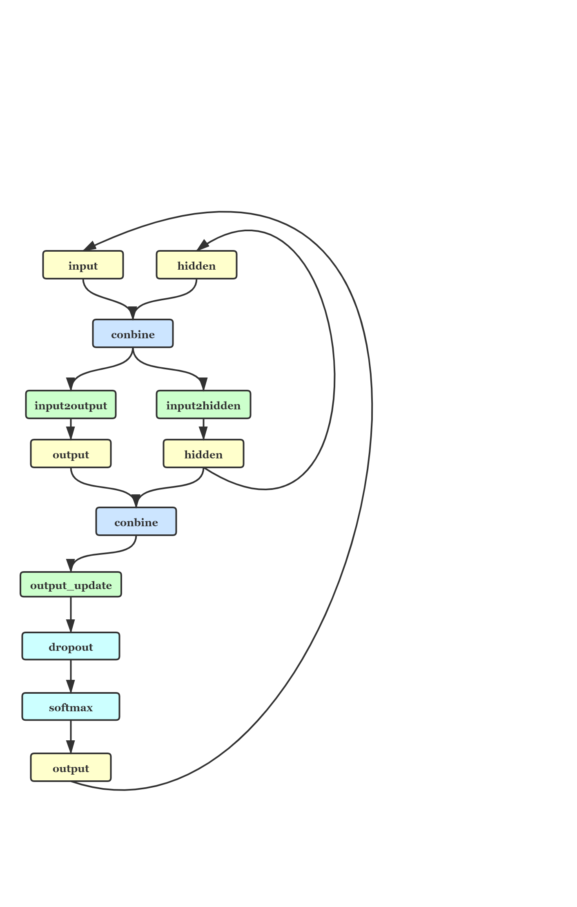
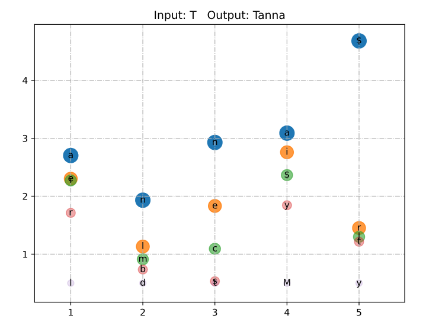
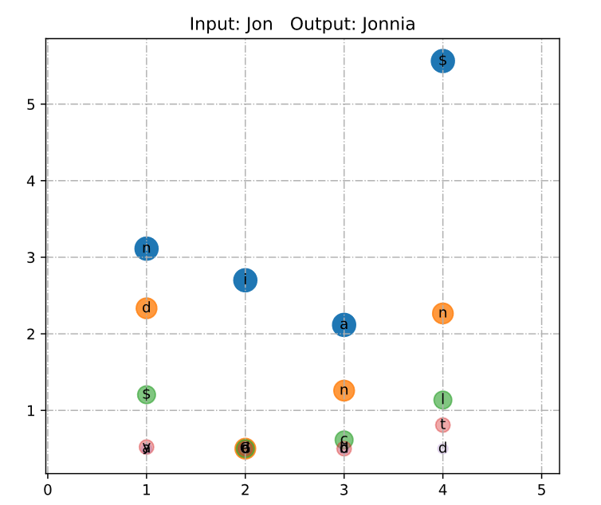

# Use RNN to pick up a name for baby/用RNN给小baby起个名字
北邮机器学习2020春

## 任务定义
训练一个环神经网络语言模型，给定若干个开始字母，由语言模型自动生成后续的字母，直到生成一个名字的结束符。从模型生成的名字中，挑选你最喜欢的一个，并采用一种可视化技术，绘制出模型为每个时刻预测的前5个最可能的候选字母。

## 输入输出
输入为字母的one-hot向量，输出为字母的预测向量。

## 方法描述
### 数据载入以及预处理
数据载入使用了pytorch中的Dataset和DataLoader。先是定义Dataset，将数据拿到Dataset中，再使用DataLoader将数据加载进来，在DataLoader中设置了shuffle为True，进行网络的训练时随机选取数据，以取得更好的效果。
### 部分参数
训练的epoch数为50，将整个数据集训练50遍；使用的学习速率为1e-4；使用的计算损失的函数为交叉熵损失函数。
### 训练方法
训练时每个名字为一个one-hot向量的组合，每次输入一个one-hot向量，然后将输出与真实名字的下一个字母进行比较，计算损失。比如Tanna，输入顺序为T-a-n-n-a，对应的真实名字输出顺序为：a-n-n-a-$，$为名字的终结符。每个名字循环完成之后，用叠加起来的loss对进行参数的更新，比每个字母都进行参数更新的效果要好。
将叠加起来的loss除以每个单词的长度作为单词的loss，每个epoch中所有单词的loss加起来作为整个epoch的损失，训练时可见随着训练遍数的增加，损失在不断下降
### 网络结构

将输入和记忆（隐层）结合，结合后分别经过变换得到暂时的output和hidden，然后将output和hidden相结合后经过变换与dropout和softmax，得到与input相同大小的output，再将这个output作为输入进入网络继续循环。
### 可视化方法
进行可视化时并没有想到很好的能把每一步的最好的五个候选字母给表示出来的方法，斟酌了挺久最后还是选择了用散点图的方式进行表示。

将可能性作为y轴，可能性比较大的点同时也有更大的半径、更深的颜色。最后对五个字母进行排序使用不同的基色，只看蓝色的点就能看出最后生成的名字。
## 结果分析

### 可视化效果
当输入一个字母T时，生成Tanna过程如下图所示：

X轴为生成的字母的次序，比如第2步中，网络中已读入Ta，此时前5个最可能的候选字母分别为n, l, m, b, d，其中n的可能性最高，所以选择了n。

蓝色的点为每一步中可能性最大的候选字母，在此例中分别为a-n-n-a-$，最后的$符号位终结符，所以得到的名字为Tanna。

类似地，当输入为Jon时得到Jonnia，每一步的中前5个最可能的候选字母分别如下图所示：

### 性能评价
如在训练方法中所描述的，每一遍对数据集的训练loss都在不断下降，训练50遍后得到了最后的模型。

最后一遍对数据集的训练中，对整个数据集的损失为19084.659907690042，得到了一个还可以的效果，由于在在自己的电脑上训练速度比较慢，所以并没有多次调整参数进行实验，如果有一块比较好的显卡的话，有机会多试一点参数应该能得到更好一点的模型。

## 编程和实验的软硬件环境
实验使用硬件为CUP: Intel® Core™ i5-7300HQ

操作系统：Microsoft Windows 10 Pro, Version 10.0.19041 Build 19041

使用深度学习框架为：pytorch	1.5.0+cu92	
